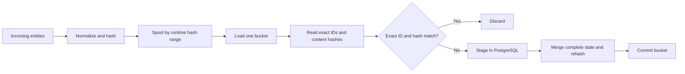

# PostgreSQL Ingest Architecture Philosophy

The hash-filtered ingest path is designed around one idea: **reduce database work without copying the database into
the client**. Incoming data may be much larger than memory, may contain partial updates, and may use stable source IDs
that are unrelated to PostgreSQL's internal row IDs. The design therefore uses hashes to narrow the work while keeping
exact identities and PostgreSQL's stored state authoritative.

For API details and operational guidance, see [PostgreSQL hash-filtered ingest](postgresql_ingest.md).

## Core principles

### Hashes are filters, not identity

Every node and edge has a 32-bit identity hash used only to select a range of indexed rows. A node's exact identity is
its `objectid`; an edge's exact identity is `(start objectid, kind, end objectid)`. Hash collisions are safe because the
client always compares the full identity after the range read.

A separate 16-byte content hash answers a narrower question: does this exact stored identity already have the same
complete logical content as the incoming record? An exact identity-and-content-hash match can be discarded. A mismatch
must continue to PostgreSQL.

### Bound memory instead of mirroring the graph

Input is normalized, hashed, and spooled into local files by identity-hash range. The bucket count is chosen at runtime
and is not stored in PostgreSQL. This lets a caller trade database round trips and file overhead for a smaller working
set without changing the schema.

Only one bucket is brought into memory at a time. For that bucket, the client reads only exact identity fields and
content hashes from PostgreSQL—not complete graph objects. Large ingests therefore require bounded memory even when the
graph and incoming dataset do not fit in a single process.

### PostgreSQL owns merge semantics

Incoming records may be partial. The client cannot safely conclude that a hash mismatch represents a logical change
without also reproducing the database's merge behavior and complete stored state. Instead, the client removes only
proven matches and stages every mismatch.

PostgreSQL performs the additive merge, unions node kinds, applies incoming property values, and computes the content
hash from the resulting complete row. This preserves one authoritative implementation of persistence semantics. It
also means that some staged partial updates are legitimate database no-ops; avoiding those writes is less important
than preserving correctness.

### External edge identities must survive ingest

An ingest producer knows endpoint `objectid` strings but cannot know PostgreSQL's generated node IDs. Edges therefore
arrive with source endpoint strings, and those strings are persisted on the edge. Internal endpoint IDs are resolved
only for records that actually need to be staged.

This makes edge bucketing stable before database access and prevents the ingest protocol from depending on database
surrogate IDs.

### Failure is localized and replay is the recovery model

Nodes are completed before edges so that newly supplied endpoints exist before edge resolution. Each populated bucket
commits in its own transaction. A failure rolls back the current bucket and stops later work, while earlier buckets
remain committed.

There is deliberately no checkpoint protocol in this proof of concept. After correcting a failure, callers replay the
complete input. Exact hash matches make already-committed work cheap to revisit.

## Data flow

The node phase follows this flow first. The edge phase repeats it, adding endpoint resolution immediately before
staging mismatches.

## Intentional constraints

- A managed graph has one writer: this ingest path. Mixing direct SQL, Cypher writes, `BatchOperation`, or concurrent
  ingests can make stored hashes stale and invalidate the no-op filter.
- Existing graphs are adopted through a rebuild, not an online backfill. Changes to canonical hashing rules likewise
  require a new hash version and rebuild.
- Bucket count is workload-specific. Sparse input generally benefits from more buckets; dense input generally benefits
  from fewer, larger buckets.
- Spooling moves memory pressure to local disk. The spool directory must be private, trusted, and sized for the input.
- Optional `CLUSTER` support is an offline locality experiment, not routine maintenance or part of correctness.

These constraints keep the proof of concept focused: demonstrate that precise indexed reads, bounded-memory spooling,
and database-owned merges can make large additive ingests cheaper without weakening identity or update correctness.
