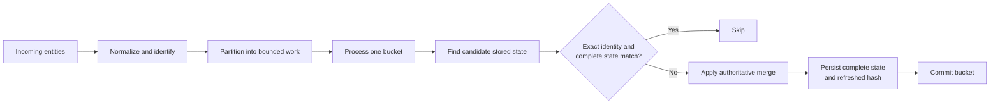

# Hash-Filtered Ingest: Architecture Philosophy

Hash-filtered ingest is a way to make repeated, large-scale graph loads cheaper without treating a hash as the source of
truth. It is intended for data that may be larger than process memory, may arrive as partial updates, and uses stable
source identities rather than database row IDs.

The central idea is simple: use inexpensive hashes to find the small set of records that might need work, then use
complete identities and authoritative graph semantics to decide what actually changes.

This guide describes the principles that should remain true as the implementation evolves. For the current PostgreSQL
API, data contract, and operating guidance, see [PostgreSQL hash-filtered ingest](postgresql_ingest.md).

## A running example

Imagine a scheduled import from a company directory. Each run describes people, teams, and memberships. It might say
that `employee:alice` is a `Person` named Alice, that `team:platform` is a `Team`, and that Alice is a member of that
team. Tomorrow's run will contain many of the same facts again, perhaps with a changed title for Alice or with only a
partial record from a source that knows her department but not her name.

The ingest system wants the second run to be inexpensive without losing the ability to correctly combine those partial
facts. The rest of this guide follows that example.

## The problem it solves

Many ingest jobs re-send data that is already present. A conventional upsert path must still locate and consider every
record, and a client that tries to avoid that work can end up loading too much of the graph into memory or duplicating
the graph's merge rules.

Hash-filtered ingest separates those concerns. It narrows each database lookup to records in the relevant hash range,
lets proven unchanged records bypass the write path, and processes the input in bounded pieces. The result is an
optimization for additive ingest, not a new definition of graph identity or merge behavior.

## Core principles

### Hashes narrow the search; identities establish the match

An identity hash groups records into a small, indexed search range. It is deliberately not treated as identity: hashes
can collide, while graph identities cannot be ambiguous. After a range is read, the system compares the complete
identity before deciding that two records refer to the same entity.

For example, a node's stable source identity is its `objectid`; an edge's is its directed source-endpoint-and-kind
tuple. The current POC uses a 32-bit identity hash to select ranges, but the important architectural rule is that a
hash only selects candidates. Exact identities make collisions harmless.

In the directory example, `employee:alice` is Alice's identity; it stays the same even if her display name changes.
Suppose `employee:alice` and `employee:alicia` happen to land in the same hash range. That range tells ingest to look
at both stored records, but it must still compare the complete strings before associating an incoming update with Alice.
The extra candidate costs a little work; it cannot turn Alicia's update into Alice's.

A separate content hash represents a complete logical state for an exact identity. When both the identity and content
hash match, the record is proven unchanged and can skip further work. A mismatch means only "this might need work";
it never proves that a logical change occurred.

### Keep the working set bounded

The input is partitioned into hash ranges, called buckets. The ingest process handles one populated bucket at a time
rather than mirroring the entire input or graph in memory. The current POC uses private local spool files between
reading the stream and processing a bucket, but another implementation could use a different bounded-work queue.

Think of a directory export too large to spread across one desk. Ingest first sorts its records into labeled trays, then
brings one tray to the desk, compares its records with the relevant stored candidates, and puts the tray away before
opening the next one. The complete export and graph can be enormous, but the desk only needs room for one tray's work.

Bucket sizing is a runtime tuning choice. More buckets reduce the amount of unrelated state examined for sparse input,
while fewer buckets reduce per-bucket overhead for dense input. Changing that choice must not change graph meaning.

### Compare complete state, merge in one authoritative place

Incoming data can be partial. A record that looks different from the input alone may merge into the same stored logical
state, while a record that looks similar may differ because of fields not present in the update. Correct change
detection therefore needs a complete logical state and one authoritative definition of how updates merge.

Where the system obtains that state and applies the merge is intentionally an implementation choice. It can read full
objects and merge in the client, perform the merge in the database, or split the work between them. Whichever design is
used must preserve one canonical merge rule and refresh the content hash from the resulting complete state.

For example, the graph may already know Alice's name, title, and office. A later source sends only
`{objectid: "employee:alice", title: "Engineer"}`. That partial record cannot by itself prove whether the final graph
will change: perhaps Alice's stored title is already `Engineer`, or perhaps the merge rule normalizes it. Its content
hash mismatch is therefore a reason to evaluate the canonical merge, not a reason to assume a write is necessary.

The current POC performs its additive merge in PostgreSQL: node kinds are unioned and incoming property values win. It
stages content-hash mismatches because a partial update may still be a valid no-op after that merge. This is a current
strategy, not a constraint of the architecture.

### Preserve source identity across the full path

Producers know their own stable identifiers; they should not need database-generated row IDs to route or identify
records. In particular, an edge can be described by its source endpoint identities and kind before either endpoint has
an internal database ID.

Maintaining those source identities throughout ingest makes bucketing stable, supports precise comparisons, and lets
the persistence layer resolve internal references only when needed. The current POC persists source endpoint IDs for
its managed edges; future implementations may represent this information differently while retaining the same
principle.

### Make replay the normal recovery path

Work is committed in independent units. If processing stops, completed units remain durable and the active unit rolls
back. Retrying the original input is then the ordinary recovery mechanism: records that are already known to match are
filtered quickly, and only remaining or changed records continue.

If the import completes the tray containing Alice and then fails while processing the Platform team, the next run can
start from the full directory export. Alice's already-persisted state is recognized as unchanged, while the unfinished
work receives another chance to run. Operators do not need to construct a special "resume from item 8,431,217" input.

This design favors simple, observable recovery over a complex checkpoint protocol. It depends on the ingest system
being the authoritative writer for its managed data: writes that bypass hash maintenance can make a later unchanged
decision unsafe.

## Conceptual flow

Nodes are processed before edges so an edge may refer to a node supplied by the same ingest. Edge processing adds
endpoint resolution at the point its persistence strategy requires it.

## Architectural boundaries

- **Additive, not synchronizing:** this path creates and updates entities; it does not infer deletions from omitted
  input.
- **One coordinated writer:** all writes to a managed graph must preserve the identity and content-hash contract.
  Concurrent ingest or unrelated write paths need coordination before they can safely share that graph.
- **Versioned logical representation:** changing identity rules, canonical content encoding, or merge semantics requires
  a deliberate compatibility and rebuild strategy.
- **Bounded resources have a cost:** local spooling trades memory pressure for trusted disk capacity; other bounded
  queue designs have their own durability and operations trade-offs.

These principles make hash-filtered ingest adaptable. The storage engine, hash algorithm, batch transport, and location
of merge work can change, provided that exact identities remain authoritative, complete logical state determines
unchanged records, and processing stays safe to replay.
