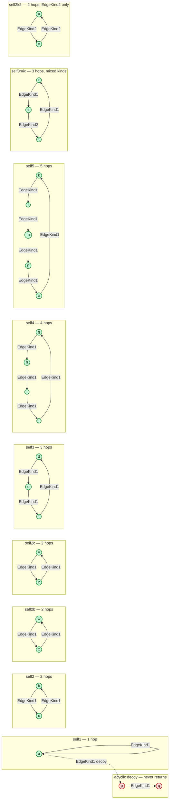

# self_cycles dataset

Visualization of the `self_cycles.json` OpenGraph fixture used by
`integration/testdata/cases/self_cycles.json`.

- **26 nodes, 26 edges**, node kind `NodeKind1`, edge kinds `EdgeKind1` and
  `EdgeKind2`.
- Cycle nodes each lie on a cycle, so they can reach themselves — a correct
  untyped `(n)-[*..]->(n)` returns all of them (`root_id = next_id`). Only node
  `a` has a literal self-edge (`a→a`); every other cycle node closes the loop
  over 2–5 hops.
- The decoy nodes (`p`, `q`) form a dead-end branch reachable from `a` (dashed
  decoy edge `a→p→q`). They never return to themselves, so a correct self-loop
  query must exclude them.
- The decoy edge `a→p` is the key adversarial case: node `a` has both a real
  1-hop self-loop **and** an outgoing branch to `p`, so the query must not
  confuse "reachable from `a`" with "returns to `a`".
- **Multiple relationship kinds:** `self3mix` is a cycle whose edges span both
  kinds, and `self2k2` is an `EdgeKind2`-only cycle. Together they exercise
  untyped self-loops (must cross kinds) and typed `(n)-[:Kind*..]->(n)`
  self-loops (must filter by kind).

| Cycle group | Nodes | Structure | Hops | Edge kinds |
|---|---|---|---|---|
| `self1` | `a` | `a→a` | 1 | K1 |
| `self2` | `b,c` | `b→c→b` | 2 | K1 |
| `self2b` | `w,x` | `w→x→w` | 2 | K1 |
| `self2c` | `y,z` | `y→z→y` | 2 | K1 |
| `self3` | `d,e,f` | `d→e→f→d` | 3 | K1 |
| `self4` | `g,h,i,j` | `g→h→i→j→g` | 4 | K1 |
| `self5` | `k,l,m,n,o` | `k→l→m→n→o→k` | 5 | K1 |
| `self3mix` | `r,s,t` | `r→s→t→r` | 3 | K1, K2, K1 |
| `self2k2` | `u,v` | `u→v→u` | 2 | K2 |
| `acyclic` | `p,q` | `a→p→q` (dead-end) | — | K1 |

Typed-self-loop expectations:
- `(n)-[:EdgeKind1*..]->(n)` returns `self1`–`self5` (all K1 cycles) but
  **excludes** `self3mix` (can't close with only K1) and `self2k2` (K2-only).
- `(n)-[:EdgeKind2*..]->(n)` returns **only** `self2k2`.

## Test cases

The cases below are defined in `integration/testdata/cases/self_cycles.json` and
run against this dataset.

### Untyped variable-length self-loops — `(n)-[*..]->(n)`

| Cypher | Expected result |
|---|---|
| `match (n)-[*..]->(n) return n` | The 24 nodes on a cycle; excludes the 2 acyclic decoy nodes (`p`, `q`). |
| `match (n)-[*..]->(n) where n.cycle = 'acyclic' return n` | Empty — decoy nodes `p`, `q` are reachable from `a` but never return. |
| `match p = (n)-[*..]->(n) where n.name = 'a' return p` | One 1-hop path `a→a`; the `a→p` decoy branch is not followed. |
| `match p = (n)-[*..]->(n) where n.name = 'b' return p` | One 2-hop path `b→c→b` over two EdgeKind1 edges. |
| `match p = (n)-[*..]->(n) where n.name = 'd' return p` | One 3-hop path `d→e→f→d` over three EdgeKind1 edges. |
| `match (n)-[*..]->(n) where n.cycle = 'self4' return n` | The 4 members of `self4`: `g`, `h`, `i`, `j`. |
| `match (n)-[*..]->(n) where n.cycle = 'self3mix' return n` | All 3 members `r`, `s`, `t`; the cycle closes only by crossing edge kinds. |
| `match p = (n)-[*..]->(n) where n.name = 'r' return p` | One 3-hop path `r→s→t→r` spanning EdgeKind1, EdgeKind2, EdgeKind1. |

### Typed variable-length self-loops — `(n)-[:Kind*..]->(n)`

| Cypher | Expected result |
|---|---|
| `match (n)-[:EdgeKind1*..]->(n) return n` | The 19 nodes on all-EdgeKind1 cycles; excludes mixed-kind and EdgeKind2-only cycles. |
| `match (n)-[:EdgeKind1*..]->(n) where n.cycle = 'self3mix' return n` | Empty — `self3mix` cannot close using EdgeKind1 alone. |
| `match (n)-[:EdgeKind1*..]->(n) where n.cycle = 'self2k2' return n` | Empty — `self2k2` is EdgeKind2-only. |
| `match (n)-[:EdgeKind2*..]->(n) return n` | The 2 nodes `u`, `v` of the only EdgeKind2-only cycle. |
| `match p = (n)-[:EdgeKind2*..]->(n) where n.name = 'u' return p` | One 2-hop path `u→v→u` over two EdgeKind2 edges. |

### Fixed-length round-trips

| Cypher | Expected result |
|---|---|
| `match p = (a)-[:EdgeKind1]->(b)-[:EdgeKind1]->(a) return p limit 100` | All 6 two-hop EdgeKind1 round-trip paths. |
| `match (a)-[]->(b)-[]->(a) return a, b limit 100` | All 8 two-hop round-trip endpoint pairs. |
